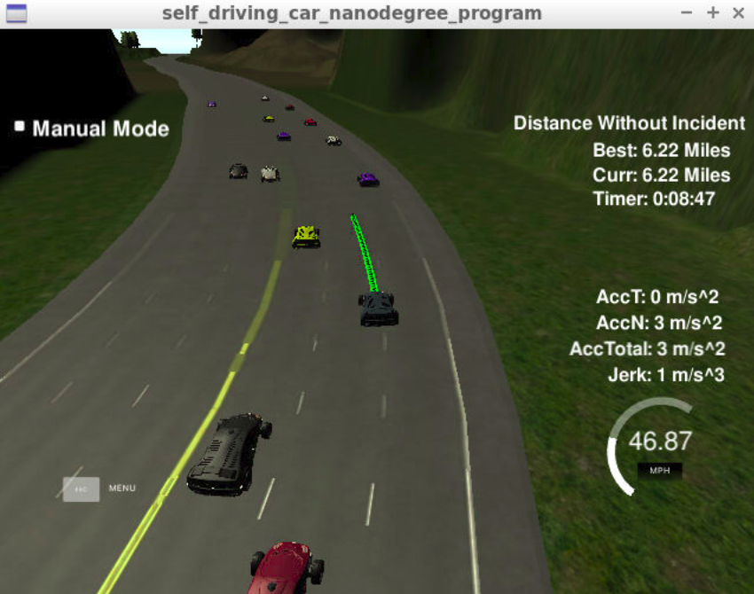
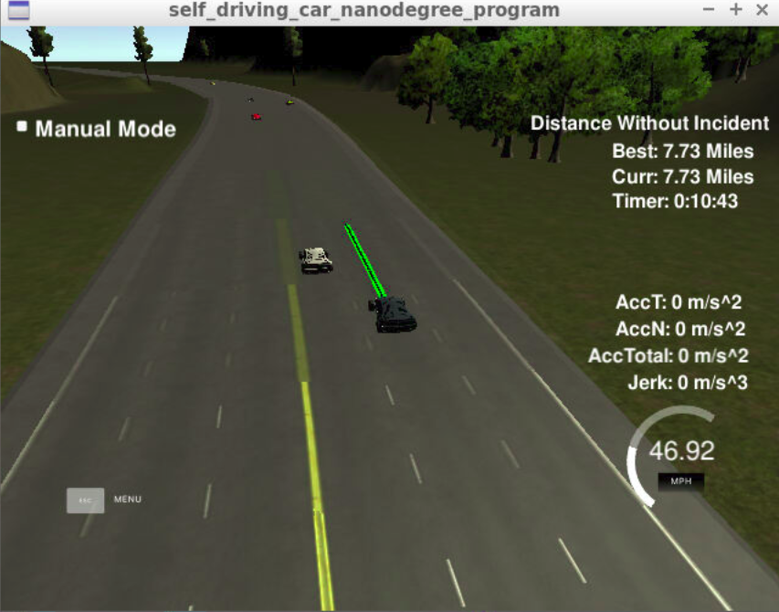

# CarND-Path-Planning-Project



Self-Driving Car Engineer Nanodegree Program

### Introducton
In this project my goal is to safely navigate around a virtual highway with other traffic that is driving +-10 MPH of the 50 MPH speed limit. Input include the car's localization and sensor fusion data, there is also a sparse map list of waypoints around the highway. The car should try to go as close as possible to the 50 MPH speed limit, which means passing slower traffic when possible, note that other cars will try to change lanes too. The car should avoid hitting other cars at all cost as well as driving inside of the marked road lanes at all times, unless going from one lane to another. The car should be able to make one complete loop around the 6946m highway. Since the car is trying to go 50 MPH, it should take a little over 5 minutes to complete 1 loop. Also the car should not experience total acceleration over 10 m/s^2 and jerk that is greater than 10 m/s^3.

#### The map of the highway is in data/highway_map.txt
Each waypoint in the list contains  [x,y,s,dx,dy] values. x and y are the waypoint's map coordinate position, the s value is the distance along the road to get to that waypoint in meters, the dx and dy values define the unit normal vector pointing outward of the highway loop.

The highway's waypoints loop around so the frenet s value, distance along the road, goes from 0 to 6945.554.

## Basic Build Instructions

1. Clone this repo.
2. Make a build directory: `mkdir build && cd build`
3. Compile: `cmake .. && make`
4. Run it: `./path_planning`.

## Dependencies

* cmake >= 3.5
  * All OSes: [click here for installation instructions](https://cmake.org/install/)
* make >= 4.1
  * Linux: make is installed by default on most Linux distros
  * Mac: [install Xcode command line tools to get make](https://developer.apple.com/xcode/features/)
  * Windows: [Click here for installation instructions](http://gnuwin32.sourceforge.net/packages/make.htm)
* gcc/g++ >= 5.4
  * Linux: gcc / g++ is installed by default on most Linux distros
  * Mac: same deal as make - [install Xcode command line tools]((https://developer.apple.com/xcode/features/)
  * Windows: recommend using [MinGW](http://www.mingw.org/)
* [uWebSockets](https://github.com/uWebSockets/uWebSockets)
  * Run either `install-mac.sh` or `install-ubuntu.sh`.
  * If you install from source, checkout to commit `e94b6e1`, i.e.
    ```
    git clone https://github.com/uWebSockets/uWebSockets 
    cd uWebSockets
    git checkout e94b6e1
    ```
# [Rubic](https://review.udacity.com/#!/rubrics/1020/view) points

## Compilation

The code compiles correctly. Added an external library spline.h for generating trajectory points.
## Valid trajectories
### The car is able to drive at least 4.32 miles without incident.
I ran the simulator for 15 and 20 miles without incidents:



### The car drives according to the speed limit.
No speed limit red message was seen.

### Max Acceleration and Jerk are not Exceeded.
Max jerk red message was not seen.

### Car does not have collisions.
No collisions.

### The car stays in its lane, except for the time between changing lanes.
The car stays in its lane most of the time but when it changes lane because of traffic or to return to the center lane.

### The car is able to change lanes
The car change lanes when the there is a slow car in front of it, and it is safe to change lanes (no other cars around) or when it is safe to return the center lane.
## Reflection
The Path planning system has following main modules:

1:Behavior planning

2:Trajectory Generation

### Behavior planning(Line 227 in main.cpp and files vehicle.cpp, vehicle.h, cost.cpp, cost.h)
This module takes into account the following factors:
#####1:the current position ,velocity ,acceleration and state(lane change, Keep lane ,prepare for lane change states) of our Ego car. The current acceleration of the car is calculated based on the first to points in the previous path list.
#####2:Current position and velocity of cars around the ego car.
The above factors are used to create several trajectories(Goal states) for the Ego car.(E.g end state if the car switches to the right lane or left lane). These trajectories are then evaluated using following cost functions:
#####1:Efficiency cost
The end states that result in slowing dows the Ego car are assigned a higher cost.
#####2:Goal distance cost
The end states that result in taking car away from the goal are assigned higher cost.
#####3:Lane traffic costThe lanes which are comparatively free are assigned lower cost.
The sum of these costs is lowest for the most suitable trajectory( end state).This end state is achieved using trajectory generation.

### Trajectory Generation:
My initial efforts were in the direction of using polynomial trajectory generation for generating paths which would have required a jerk minimizing trajectory and taking into account the surrounding vehicles. Later, I found functionalities of spline.h enough to produce a decent trajectory. This required adding extra lines of code in the behavior planning file vehicle.cpp(259-265) to make sure that the trajectory stays away from other vehicles.
The trajectory generation is achieved using a library called spline.h. This library has function which generates points fitting a curve defined using points (min size > 2). In my case I defined this curve using points last two points of the previous trajectory, and 3 points that are 40, 60 and 90 meters away on the target road lane.(line 274-278 in main.cpp)
#### Trajectory point generation(324 – 357):
The spacing between the points decides the speed of the car. In order to make sure that the acceleration and jerk do not exceed during subsequent trajectories, this section includes an if-else code which makes sure for accelerations above a certain threshold, the speed increases in a more brisk manner.


